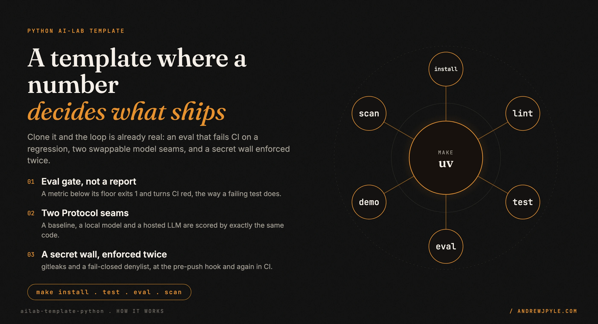
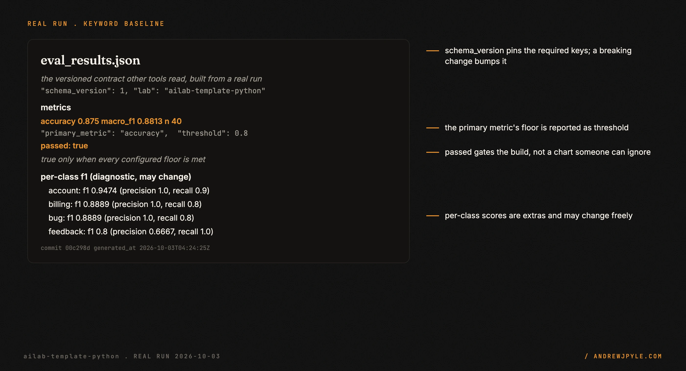
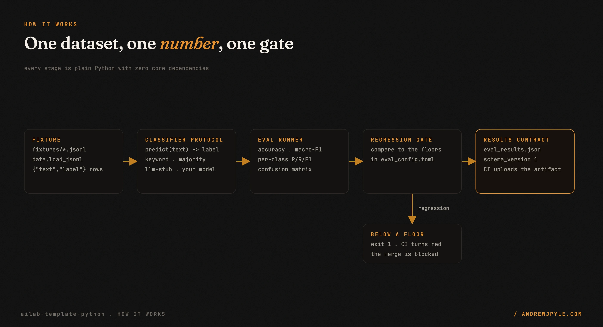
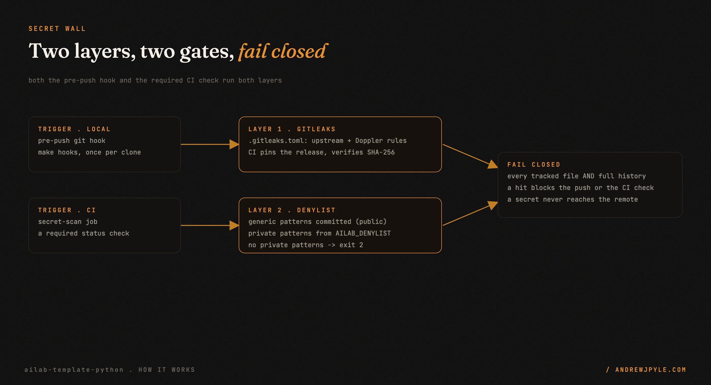

<p align="center">
  
</p>

<p align="center">
  <a href="https://github.com/andrewjpyle/ailab-template-python/actions/workflows/ci.yml"></a>
  
  
  
</p>

# A Python AI-lab template where a number decides what ships

Most "AI experiment" repos end with a notebook and a chart nobody blocks a merge on. This is the
other shape: a small, opinionated GitHub template for Python AI-lab repos (evals, RAG, bandits) where
a metric, not an opinion, decides whether a change ships. The bundled example is deliberately tiny:
it classifies synthetic support messages into four intents with a keyword baseline, so the loop is
real without being clever.

- **An eval loop with a regression gate.** CI fails when a metric drops below its floor, the same way
  a failing test does.
- **Two `Protocol` seams** (`Classifier`, `LLMProvider`) so a baseline, a local model and a hosted LLM
  are scored by exactly the same code.
- **A secret wall enforced twice:** a `pre-push` git hook and a required CI check, each running two
  layers over every tracked file and the full history.
- **Reproducible by default:** a `uv` lockfile, ruff, mypy `--strict`, pytest with a 90 percent
  coverage floor, and a non-root multi-stage container configured entirely by environment variables.

> **The one idea worth stealing, even if you never run this code:** make the eval a gate, not a report.
> Put the thresholds in version control next to the code, and let a regression exit non-zero and turn
> CI red. "accuracy must stay at or above 0.80" in a committed file beats a dashboard nobody blocks a
> merge on. If a number cannot fail the build, it will drift.

---

## 60 seconds to a gated number

The repo is offline: `make install` then `make eval` replay a committed fixture with no network and
no API key.

```bash
make install    # uv sync --locked (Python 3.12, dev tools included)
make eval        # score the classifier, write eval_results.json, enforce the floors
```

Real output from this commit (captured in [`docs/assets/src/captures/eval_run.json`](docs/assets/src/captures/eval_run.json)):

```
| Date | Commit | Model/Provider | Dataset | Metric | Score | Notes |
|---|---|---|---|---|---|---|
| 2026-10-03 | 00c298d | keyword-baseline-v1 (baseline) | support_intents (n=40) | accuracy | 0.8750 | PASS (floor 0.80) |
| 2026-10-03 | 00c298d | keyword-baseline-v1 (baseline) | support_intents (n=40) | macro_f1 | 0.8813 | PASS (floor 0.80) |
```

`ailab-eval` exits `0` when every metric meets its floor, `1` on a regression, and `2` on a bad config
or dataset. The run also writes `eval_results.json`, the versioned contract other tools read:

<p align="center"></p>

Other make targets: `make lint` (ruff + mypy `--strict`), `make test` (pytest, fails under 90 percent
coverage), `make demo` (classify a few samples, then eval), `make scan` (the secret wall). Or run the
whole thing in a container with `docker compose up`.

## Use this template

This repo is a starting point, not a library. Every file is copied into each lab built from it.

1. On GitHub, click **Use this template** (or
   `gh repo create my-lab --template andrewjpyle/ailab-template-python`).
2. Clone it, then **enable the git hooks. This is required, not optional:**

   ```bash
   brew install gitleaks   # the pre-push hook refuses to run without it
   make install hooks
   ```

3. Provide your private denylist (see [Secret scanning](#secret-scanning)), locally and as the
   `AILAB_DENYLIST` repository secret.
4. Rename the package (`src/ailab_template` and the `pyproject.toml` entries), replace the fixture with
   your lab's dataset, and add your model behind the `Classifier` protocol.
5. Set honest thresholds in `eval_config.toml`, then protect `main` and require the `secret-scan`,
   `lint`, `test`, `eval` and `docker` checks.

## Configuration

Configuration is layered: defaults, then `eval_config.toml`, then environment variables, then CLI
flags. The same thresholds apply on a laptop, in Docker and in CI.

| Variable | Default | Purpose |
|---|---|---|
| `AILAB_CONFIG` | `eval_config.toml` | Config file path |
| `AILAB_LAB` | `ailab-template-python` | Lab name recorded in results |
| `AILAB_DATASET` | `fixtures/support_intents.jsonl` | JSONL dataset (`{"text", "label"}` rows) |
| `AILAB_CLASSIFIER` | `keyword` | `keyword`, `majority` or `llm-stub` |
| `AILAB_OUTPUT` | `eval_results.json` | Results file |
| `AILAB_MIN_ACCURACY` | `0.80` | Accuracy floor |
| `AILAB_MIN_MACRO_F1` | `0.80` | Macro-F1 floor |
| `AILAB_PRIMARY_METRIC` | `accuracy` | Metric whose floor is reported as `threshold` |
| `AILAB_COMMIT` | `git rev-parse HEAD` | Commit recorded in results (`GITHUB_SHA` wins in CI) |

### Results file contract

`eval_results.json` is read by tooling outside this repo, so its top-level shape is versioned
(`schema_version: 1`). The keys below are always present; others are diagnostic extras (per-class
scores, confusion matrix, failures) and may change. A breaking change to these keys must bump
`schema_version`.

```json
{
  "schema_version": 1,
  "lab": "ailab-template-python",
  "dataset": "support_intents",
  "provider": "baseline",
  "model": "keyword-baseline-v1",
  "primary_metric": "accuracy",
  "metrics": {"accuracy": 0.875, "macro_f1": 0.8813, "n": 40},
  "threshold": 0.8,
  "passed": true,
  "commit": "<full git sha, or null>",
  "generated_at": "2026-10-01T21:00:20Z"
}
```

`passed` is true only when every configured floor is met.

## How it works

<p align="center"></p>

A fixture of `{"text", "label"}` rows is loaded by `data.load_jsonl`. Each classifier implements one
`predict(text) -> label` method, so the runner never cares what is inside it. The runner scores the
predictions (accuracy, per-class precision, recall and macro-F1, a confusion matrix), compares each
metric to the floors in `eval_config.toml`, and writes `eval_results.json`. If any metric is below its
floor the run exits `1` and CI turns red.

The boundaries are deliberate. The template reads only the dataset you point it at, and the only thing
that can fail the build is a number below a floor you declared. There is no network in the core and no
vendor SDK: a real model backend lives behind the `LLMProvider` seam in your own lab.

| Path | What lives there |
|---|---|
| `src/ailab_template/classifiers.py` | `Classifier` protocol, keyword and majority baselines |
| `src/ailab_template/providers.py` | `LLMProvider` protocol, offline `StubProvider`, `LLMClassifier` adapter |
| `src/ailab_template/metrics.py` | Accuracy, per-class P/R/F1, macro-F1, confusion matrix |
| `src/ailab_template/eval.py` | Runner and regression gate (`ailab-eval`) |
| `src/ailab_template/config.py` | TOML and environment configuration |
| `fixtures/` | Synthetic data only; provenance in [FIXTURES.md](FIXTURES.md) |
| `scripts/denylist_scan.sh`, `.githooks/`, `.gitleaks.toml` | The secret wall |

Design decisions and the alternatives that were rejected are in [docs/DESIGN.md](docs/DESIGN.md); the
concepts behind them are in [docs/LEARNING.md](docs/LEARNING.md).

## Secret scanning

<p align="center"></p>

Two layers run at two gates: the `pre-push` hook (`make hooks`) and the required `secret-scan` CI job.

1. **gitleaks** with [`.gitleaks.toml`](.gitleaks.toml): the upstream default rules plus a rule for
   every Doppler token type. The hook scans the outgoing commits (all reachable commits for a new
   branch); CI scans the full history. CI downloads a pinned gitleaks release and verifies its
   SHA-256 before running it.
2. **Denylist scan** ([`scripts/denylist_scan.sh`](scripts/denylist_scan.sh)): case-insensitive
   extended regexes checked against every tracked file and every patch and commit message in the full
   history.
   - **Generic** patterns are public and committed in [`.denylist-generic.txt`](.denylist-generic.txt)
     (overlay-network hostnames and addresses, secrets-manager token shapes).
   - **Private** patterns (names that must never appear publicly) are never committed, because the list
     itself would leak them. Supply them as newline-separated regexes in the `AILAB_DENYLIST`
     environment variable or repository secret, or in `~/.config/ailab/denylist.txt`.
   - The scan **fails closed**: with no private patterns it exits non-zero. Only CI for fork pull
     requests, which cannot read secrets, sets `AILAB_DENYLIST_OPTIONAL=1` and falls back to the
     generic list.
   - Hits are reported as `file:line` (or commit and path) plus the pattern number; the private pattern
     text is never printed.

If a scan fires on something already committed, rewrite the history before pushing. Deleting the line
in a new commit leaves it in the history, where the scan, and anyone else, can still read it.

## Eval results

Append a row whenever the model, provider, dataset or thresholds change. Rows are generated from the
results file, never typed by hand:

```bash
uv run ailab-eval --table-from eval_results.json
```

CI uploads the same file as the `eval-results` artifact and shows the table in each run's job summary.

| Date | Commit | Model/Provider | Dataset | Metric | Score | Notes |
|---|---|---|---|---|---|---|
| 2026-10-01 | dc29470 | keyword-baseline-v1 (baseline) | support_intents (n=40) | accuracy | 0.8750 | PASS (floor 0.80); keywords tuned on this set, so in-sample |
| 2026-10-01 | dc29470 | keyword-baseline-v1 (baseline) | support_intents (n=40) | macro_f1 | 0.8813 | PASS (floor 0.80) |
| 2026-10-01 | dc29470 | majority-baseline-v1 (baseline) | support_intents (n=40) | macro_f1 | 0.1000 | Sanity floor, not gated: always predicts one class |

See [MODEL_CARD.md](MODEL_CARD.md) for what these numbers do and do not mean.

## Scope: what it does not do

- **No real model.** The bundled classifier is a keyword baseline. A learned or hosted model is yours
  to add behind the `Classifier` and `LLMProvider` seams.
- **No network in the core.** There are zero runtime dependencies and no vendor SDK. The `StubProvider`
  is offline on purpose, so CI and the demo never need a key.
- **Not a metrics library.** Accuracy, macro-F1 and the confusion matrix are implemented by hand for a
  single-label classifier, to stay readable and testable. For multi-label or ranking metrics, bring a
  library behind the same interface.
- **Not a dataset.** The fixture is synthetic and tiny. It exists to make the loop real, not to train
  anything.

## The patterns

| Pattern | The failure it prevents |
|---|---|
| Eval as a gate, thresholds in version control | a number that cannot fail the build, so quality drifts |
| Floors in the diff, not a previous-run comparison | quality ratcheting down one quiet step at a time |
| Small `Protocol` seams, no base class | a vendor choice and a framework baked into every lab |
| A baseline and a majority floor first | paying for a model that never beat a keyword list |
| A versioned results contract | a renamed key silently breaking a downstream consumer |
| Secret wall in two layers, at two gates | a secret that slips past one tool or one checkpoint |
| Fail closed with no private patterns | a scan that passes because it was never configured |

## FAQ

**Why not just a notebook with a chart?** A chart does not block a merge. The whole point here is that
a regression exits non-zero and fails CI, so the number has teeth.

**Does it need an LLM or an API key?** No. The core is plain Python with zero runtime dependencies. The
`llm-stub` classifier exercises the full prompt, complete and parse path offline.

**Why `Protocol` instead of a base class?** Structural typing. Anything with the right attributes and
`predict` plugs in, with nothing to inherit and no coupling to this package.

**Can I keep private names out of a public repo?** That is what the denylist layer is for. Private
patterns live in a secret, never in the repo, and the scan fails closed if they are missing.

## Roadmap

- A second worked example on a different task shape (for example retrieval), behind the same seams.
- Optional batch prediction on the `Classifier` protocol for real LLM throughput.
- A results-diff helper that prints the metric deltas between two `eval_results.json` files.

## License

[Apache License 2.0](LICENSE). Copyright 2026 [Andrew Pyle](https://andrewjpyle.com).
