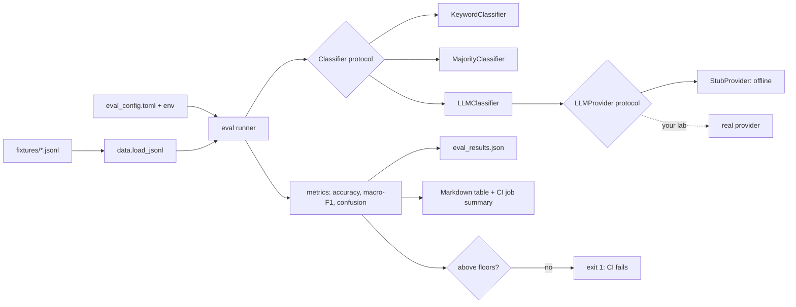

# ailab-template-python

[](https://github.com/andrewjpyle/ailab-template-python/actions/workflows/ci.yml)
[](LICENSE)


A small, opinionated GitHub template for Python "AI lab" repos: evals, RAG, bandits,
and other experiments where **a number decides whether a change ships**.

Every repo cloned from it starts with:

- an **eval loop with a regression gate**: CI fails if a metric drops below its floor;
- **pluggable seams** (`Classifier`, `LLMProvider`) so a baseline, a local model and a
  hosted LLM are scored by exactly the same code;
- **reproducible tooling**: `uv` lockfile, ruff, mypy, pytest with a coverage floor;
- a **non-root, multi-stage container** configured entirely by environment variables;
- a **secret wall** enforced twice: a `pre-push` git hook *and* a required CI check.

The bundled example is deliberately tiny: classifying synthetic support messages into
four intents with a keyword baseline. It exists to make the loop real, not to be clever.

## Using the template

1. On GitHub, click **Use this template** (or `gh repo create my-lab --template andrewjpyle/ailab-template-python`).
2. Clone it, then **enable the git hooks. This is required, not optional**:

   ```bash
   brew install gitleaks   # the pre-push hook refuses to run without it
   make install hooks
   ```

3. Provide your private denylist (see [Secret scanning](#secret-scanning)), locally and as
   the `AILAB_DENYLIST` repository secret.
4. Rename the package (`src/ailab_template` and the `pyproject.toml` entries), replace the
   fixture with your lab's dataset, and add your model behind the `Classifier` protocol.
5. Set honest thresholds in `eval_config.toml`, then protect `main` and require the
   `secret-scan`, `lint`, `test`, `eval` and `docker` checks.

## Quickstart

```bash
make install    # uv sync --locked (Python 3.12, dev tools included)
make lint       # ruff check, ruff format --check, mypy --strict
make test       # pytest with branch coverage (fails under 90%)
make eval       # score the classifier, write eval_results.json, enforce thresholds
make demo       # classify a few sample messages, then run the eval
make scan       # gitleaks over full history + denylist scan

docker compose up        # build the image and run the demo + eval in a container
```

`ailab-eval` exits `0` when every metric meets its floor, `1` on a regression, and `2`
on a bad config or dataset. Configuration is layered: defaults, then
`eval_config.toml`, then environment variables, then CLI flags.

| Variable | Default | Purpose |
|---|---|---|
| `AILAB_CONFIG` | `eval_config.toml` | Config file path |
| `AILAB_LAB` | `ailab-template-python` | Lab name recorded in results |
| `AILAB_DATASET` | `fixtures/support_intents.jsonl` | JSONL dataset (`{"text", "label"}` rows) |
| `AILAB_CLASSIFIER` | `keyword` | `keyword`, `majority` or `llm-stub` |
| `AILAB_OUTPUT` | `eval_results.json` | Results file |
| `AILAB_MIN_ACCURACY` | `0.80` | Accuracy floor |
| `AILAB_MIN_MACRO_F1` | `0.80` | Macro-F1 floor |
| `AILAB_PRIMARY_METRIC` | `accuracy` | Metric whose floor is reported as `threshold` |
| `AILAB_COMMIT` | `git rev-parse HEAD` | Commit recorded in results (`GITHUB_SHA` wins in CI) |

### Results file contract

`eval_results.json` is read by tooling outside this repo, so its top-level shape is
versioned (`schema_version: 1`). These keys are always present; others are diagnostic
extras (per-class scores, confusion matrix, failures) and may change.

```json
{
  "schema_version": 1,
  "lab": "ailab-template-python",
  "dataset": "support_intents",
  "provider": "baseline",
  "model": "keyword-baseline-v1",
  "primary_metric": "accuracy",
  "metrics": {"accuracy": 0.875, "macro_f1": 0.8813, "n": 40},
  "threshold": 0.8,
  "passed": true,
  "commit": "<full git sha, or null>",
  "generated_at": "2026-10-01T21:00:20Z"
}
```

`passed` is true only when *every* configured floor is met. A breaking change to these
keys must bump `schema_version`.

## Architecture



| Path | What lives there |
|---|---|
| `src/ailab_template/classifiers.py` | `Classifier` protocol, keyword and majority baselines |
| `src/ailab_template/providers.py` | `LLMProvider` protocol, offline `StubProvider`, `LLMClassifier` adapter |
| `src/ailab_template/metrics.py` | Accuracy, per-class P/R/F1, macro-F1, confusion matrix |
| `src/ailab_template/eval.py` | Runner and regression gate (`ailab-eval`) |
| `src/ailab_template/config.py` | TOML + environment configuration |
| `fixtures/` | Synthetic data only; provenance in [FIXTURES.md](FIXTURES.md) |
| `scripts/denylist_scan.sh`, `.githooks/`, `.gitleaks.toml` | The secret wall |

Design decisions and the alternatives that were rejected are in
[docs/DESIGN.md](docs/DESIGN.md); the concepts behind them are in
[docs/LEARNING.md](docs/LEARNING.md).

## Eval results

Append a row whenever the model, provider, dataset or thresholds change. Rows are
generated from the results file, never typed by hand:

```bash
uv run ailab-eval --table-from eval_results.json
```

CI uploads the same file as the `eval-results` artifact and shows the table in each
run's job summary.

| Date | Commit | Model/Provider | Dataset | Metric | Score | Notes |
|---|---|---|---|---|---|---|
| 2026-10-01 | dc29470 | keyword-baseline-v1 (baseline) | support_intents (n=40) | accuracy | 0.8750 | PASS (floor 0.80); keywords tuned on this set, so in-sample |
| 2026-10-01 | dc29470 | keyword-baseline-v1 (baseline) | support_intents (n=40) | macro_f1 | 0.8813 | PASS (floor 0.80) |
| 2026-10-01 | dc29470 | majority-baseline-v1 (baseline) | support_intents (n=40) | macro_f1 | 0.1000 | Sanity floor, not gated: always predicts one class |

See [MODEL_CARD.md](MODEL_CARD.md) for what these numbers do and do not mean.

## What this demonstrates

- **Evaluation as a gate, not a report.** Thresholds live in version control next to the
  code, and a regression fails the build the same way a broken test does.
- **Interfaces over vendors.** Models sit behind two small `Protocol`s, so swapping a
  baseline for a hosted LLM changes one factory line and none of the scoring code.
- **Baselines first.** A majority-class floor and a transparent keyword baseline set the
  bar any expensive model has to clear.
- **Metrics you can read.** Precision, recall and macro-F1 are implemented by hand, with
  edge cases (empty input, 0/0, invented labels) pinned by tests.
- **Production hygiene in a small repo.** Locked dependencies, strict typing, a coverage
  floor, a 12-factor non-root container, and CI that builds and runs the image.
- **Security by default.** Secrets and private identifiers are blocked before they leave
  a laptop and again in CI, and the private checks fail closed.

## Secret scanning

Two layers, both run by the `pre-push` hook (`make hooks`) and by the required
`secret-scan` CI job:

1. **gitleaks** with [`.gitleaks.toml`](.gitleaks.toml): the upstream default rules plus a
   rule for every Doppler token type. The hook scans the outgoing commits (all reachable
   commits for a new branch); CI scans the full history. CI downloads a pinned gitleaks
   release and verifies its SHA-256 before running it.
2. **Denylist scan** ([`scripts/denylist_scan.sh`](scripts/denylist_scan.sh)): case-insensitive
   extended regexes checked against every tracked file *and* every patch and commit
   message in the full history.
   - **Generic** patterns are public and committed in
     [`.denylist-generic.txt`](.denylist-generic.txt) (overlay-network hostnames and
     addresses, secrets-manager token shapes).
   - **Private** patterns (names that must never appear publicly) are never committed,
     because the list itself would leak them. Supply them as newline-separated regexes in
     the `AILAB_DENYLIST` environment variable or repository secret, or in
     `~/.config/ailab/denylist.txt` (override with `AILAB_DENYLIST_FILE`).
   - The scan **fails closed**: with no private patterns it exits non-zero. Only CI runs
     for pull requests from forks, which cannot read secrets, set
     `AILAB_DENYLIST_OPTIONAL=1` and fall back to the generic list.
   - Hits are reported as `file:line` (or commit and path) plus the pattern number; the
     private pattern text is never printed.

If a scan fires on something already committed, rewrite the history before pushing:
deleting the line in a new commit leaves it in the history the scan, and anyone
else, can read.

## License

[Apache License 2.0](LICENSE). Copyright 2026 Andrew Pyle.
